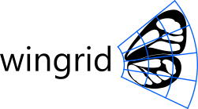

wingrid is a small Python package for quantifying and comparing "appearance" of insect wings, particularly Lepidoptera (butterflies and moths) and Odonata (dragonflies and damselflies). A deformable grid is fitted to images of wings, allowing local color values to then be consistently sampled from them. The package includes tools for analyzing and visualizing features extracted from a set of wings.

# Table of Contents
- [**Getting Started**](#getting-started)
- [**Usage**](#usage)
- [**Description**](#description)
- [**Acknowledgements & References**](#acknowledgements--references)
- [**Author**](#author)
- [**License**](#license)
- [**How to Cite**](#how-to-cite)
- [**How to Contribute**](#how-to-contribute)
- [**TODOs**](#todos)

# Getting Started
## Required Packages
wingrid was written for Python 2.7 and hasn't yet been tested on 3.x. It requires the following Python packages to run:
- Numpy (tested on 1.11.1)
- SciPy (tested on 0.18.1)
- Matplotlib (tested on 1.5.2)
- scikit-learn (>= 0.17)
- OpenCV (>= 3.1)

The easiest way to get all but OpenCV is using `pip`:
```sh
pip install --upgrade numpy,scipy,matplotlib,scikit-learn
```
Instructions for downloading and installing OpenCV can be found [here](http://opencv.org/downloads.html). Version 3.1 or higher is required as it includes the function `cv2.minEnclosingTriangle`, which is needed for grid fitting. Check the installation, version, and inclusion of this function with the following in Python:
```python
>>> import cv2
>>> cv2.__version__
'3.2.0'
>>> 'minEnclosingTriangle' in dir(cv2)
True
```

## Optional Packages
In addition, pandas is helpful for manipulating data. Get it with `pip`:
```sh
pip install --upgrade pandas
```

## Installing
If you have [git](https://git-scm.com/), you can clone the git repository to a local directory, go to that directory, and install like this:
```sh
git clone https://github.com/willkuhn/wingrid.git
cd wingrid
python setup.py install
```

Alternatively, you can download the repository, extract it, navigate to the extracted folder in the terminal or command prompt, and install by typing:
```sh
python setup.py install
```

Now you can test that wingrid was sucessfully installed in Python:
```python
>>> import wingrid
>>> wingrid.__version__
'0.1.0'
```


## Image Preparation
wingrid works with scanned images of insect wings, prepared with the following guidelines. Below is an example of a prepared image; please see this project's `images` folder for more examples.

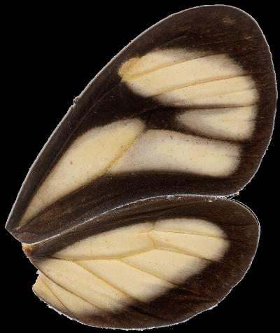

1. **Image composition:** Each image should contain a single pair of wings (a fore- and hindwing), which have been separated from the body before imaging (or the body should be cropped out). Wings should be right-facing (with their bases on the left and tips on the right), both facing dorsally or both ventrally, and should be either very close together, touching or overlapping (we set butterfly wings in a 'natural' position where they were slightly overlapping). For best results, wings should be free from dust and debris.

2. **Image acquisition:** Images may be digitized with a flatbed scanner or camera, although ideally a set of images should all be digitized in a similar way with the same device to minimize inter-device differences in image quality.

3. **Background removal:** The image background (including dust, debris, and extra wing scales) should be removed in photo editing software, such as [Gimp](https://www.gimp.org/), and replaced by a solid black or white background. If wings in several images are to be compared, they should all have a matching background (either all black or all white).

4. **Image size:** Large images are automatically reduced in size during sampling to have a maximum dimension (height or width) of 1000px. Images may be larger or smaller than this, but images in a set should ideally be similar to one another in size.

5. **File format:** It is recommended that images are saved in an uncompressed format, like PNG or TIFF. JPEG and other compressed formats should work too, but the artifacts of image compression may affect the analysis.


# Usage
The following code demonstrates most of the functionality of wingrid, and outlines some basic data management with pandas. See the [pandas site](http://pandas.pydata.org/) for in-depth coverage of its usage.

## Import wingrid and supporting packages
```python
>>> import os,cv2
>>> import numpy as np
>>> from wingrid import Grid,Analyze
```

## Fit and display some grids
Here's an original image: wings of a *Polythore* damselfly.

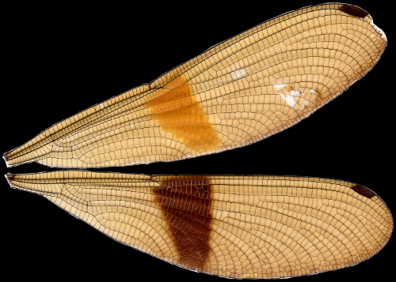

**Fit a 10x10 grid to this image and plot it:**
```python
# Get the image
>>> fn = '681.png'
>>> im = cv2.imread(os.path.join('images',fn))

# Reverse order of image's color channels
# (cv2 imports BGR but we need RGB)
>>> im = im[:,:,::-1]

# Set up and fit grid ()
>>> g = Grid(10, # n grid rows
             10, # n grid columns
             background='black') # image's background color
>>> g.fit_sample(im);

# Plot the fitted grid onto the image
>>> g.plot_grid(image=im,
>>>             show_gridlines=True,   # plot gridlines
>>>             show_cell_nums=False,   # don't number grid cells
>>>             show_tri=True,         # show minimum-enclosing triangle
>>>             show_edge_cells=True,  # gray out 'edge cells'
>>>             use_chrom=True)       # plot image in chromatic coordinates (not RGB)
```

Here is the resulting plot: the original image (transformed into the chromatic colorspace) with the minimum-enclosing triangle in green and the grid laid out in blue. "Edge cells"--those grid cells which fall partially or fully outside of the wings--are grayed out.

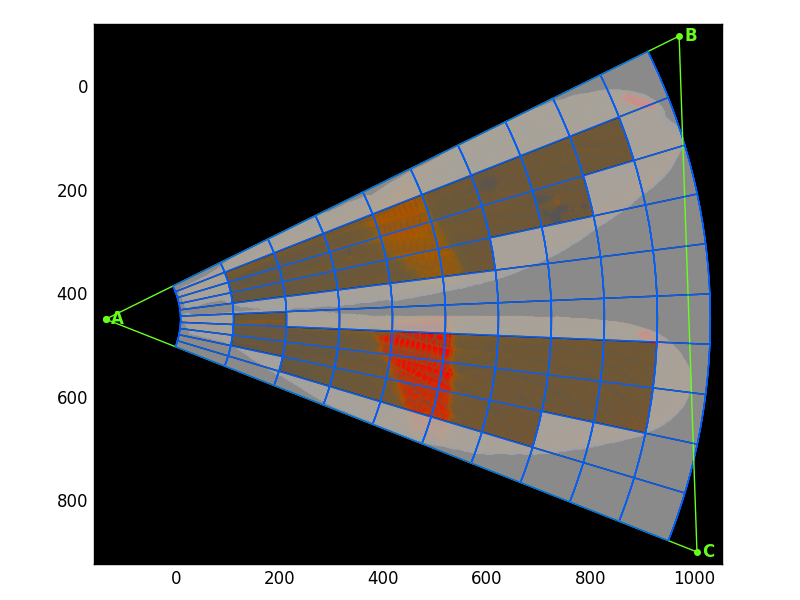

**Fit an 8x5 grid to another image (with white background) and plot the grid with some different options:**
```python
>>> fn = '2255D.png'
>>> g = Grid(8,5,background='white')
>>> g.fit_sample(im);
>>> g.plot_grid(image=im, show_gridlines=True, show_cell_nums=True,
                show_tri=False,show_edge_cells=True, use_chrom=False)
```

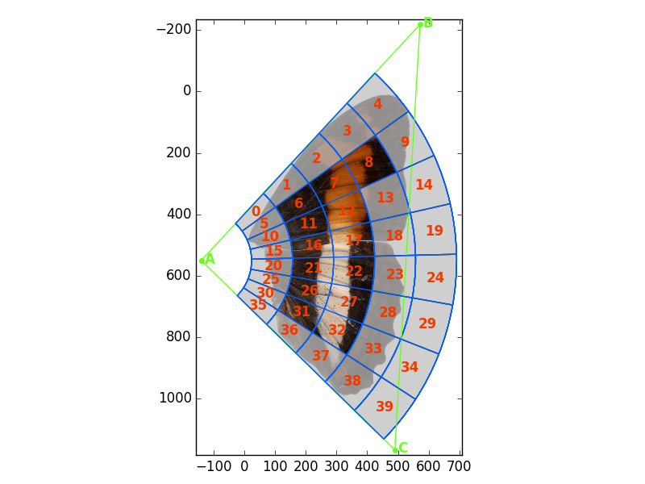


## Sample color features

**Sample a single image:**
```python
>>> fn = '681.png'
>>> im = cv2.imread(os.path.join('images',fn))[:,:,::-1]
>>> g = Grid(8,5,background='black')
>>> g.fit_sample(im)
(array([ 111.31605184,  116.19882777,  123.32599119,  110.49406229,
         119.67112299,  109.53637771,  112.9796173 ,  131.9183147 ,
         ...,             4.34933523,   11.90519015,   13.93916276,
          10.11596208,   21.73463472,   12.86757322,           nan]),
array([False, False, False, False, False, False,  True,  True,  True,
       False, False,  True,  True, False, False, False, False, False,
         ...,  True,  True,  True, False, False,  True,  True, False,
       False, False, False, False, False, False], dtype=bool))
```
`g.fit_sample(im)` returns two 1D arrays of shape (n_samples,): the extracted features and the "feature mask"--a list to keep track of edge and non-edge cells. In the features mask list non-edge cells are `True` and edge cells are `False`.

**Sample several images, all with the same 12x10 grid:**
```python
>>> import pandas as pd # for managing data
>>> import time # for timing
>>> from _future_ import print_function # in case using Python 2.7

# Read a table
>>> md = pd.read_csv(os.path.join('images','metadata.csv'),header=0) # read a table

# Initialize the grid
>>> g = Grid(12,10,background='black')

# Set up dataframes for features and f_mask
>>> features = pd.DataFrame(data=[],columns=g.f_labels_)
>>> f_mask = pd.DataFrame(data=[],columns=g.f_labels_)

# Sample each image and keep results
>>> for fn in md['filename']:
>>>     im = cv2.imread(os.path.join('images',fn))[:,:,::-1]
>>>     t0 = time.clock()
>>>     f,fm = g.fit_sample(im)
>>>     t1 = time.clock()
>>>     features.loc[fn] = f
>>>     f_mask.loc[fn] = fm
>>>     print('Finished {} in {:.3f}s'.format(fn,t1-t0))
>>> print(features.shape, f_mask.shape)
(15, 720) (15, 720)
```
This produces 2 Pandas DataFrames: `features`, which holds the color features sampled from the images, and `f_mask`, which holds the feature masks from the fitted grids. The 12x10 grid produces 720 features (12 grid rows x 10 grid columns x 2 statistics (mean & standard deviation) x 3 color channels).

## Export and import data with pandas
This is an example of some pandas and os functionality that's helpful to know for using wingrid.
```python
# Make a temporary directory (if it doesn't yet exist) to put data
>>> if not os.path.isdir('temp'):
>>>     os.mkdir('temp')

# Export pandas dataframes as CSV files
>>> fn = os.path.join('temp','features.csv')
>>> features.to_csv(fn,header=True,index=False)
>>> fn = os.path.join('temp','f_mask.csv')
>>> f_mask.to_csv(fn,header=True,index=False)

# Import CSV files to pandas dataframes
>>> fn = os.path.join('temp','features.csv')
>>> features = pd.read_csv(fn,header=0)
>>> fn = os.path.join('temp','f_mask.csv')
>>> f_mask = pd.read_csv(fn,header=0)
```

## Run a PCA on extracted color features
**Running a principal component analysis (PCA) is simple:**
```python
# Run the PCA
>>> an = Analyze(features,f_mask) # initialize analysis
>>> an.fit_pca() # do the PCA

# Or simply...
>>>an = Analyze(features,f_mask).fit_pca()
```

**Plot the first 2 principal components (PCs):**
```python
# Get labels for the plot
>>> labels = md['label']

# Make the plot
>>> title = '{} non-edge cells ({} features)'.format(an.n_features_masked_/6,
>>>                                                  an.n_features_masked_)
>>> an.plot_comps(labels,comps=[1,2],indiv_labels=None,title=title)
```

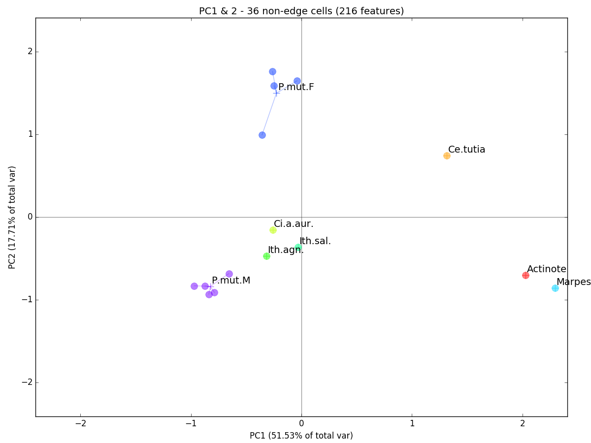
In a nutshell, the PCA simply rotates our cloud of multi-dimensional observations in space so that PC1 shows the highest axis of variation in our data (i.e. the major axis of our point cloud), PC2 shows the second highest axis (orthogonal to PC1), and so on. Here, individual observations are plotted as filled circles and are grouped (by genus or species for butterflies and species-sex for *Polythore* damselflies) by a line connecting each observation to the centroid of its group (a plus sign). While some groups only contain a single observation, it is interesting how tightly clustered the multi-observation groups appear: *Polythore mutata* females (P.mut.F) and males (P.mut.M). This seems to indicate within-group similarity in terms of wing coloration.

## Run an LDA on features
**Running an linear discriminant analysis (LDA) is just as simple:**
```python
# Run LDA using `labels`
>>> an = Analyze(features,f_mask) # initialize analysis
>>> an.fit_lda(labels) # do the LDA

# or chain it, like PCA
>>> an = Analyze(features,f_mask).fit_lda(labels)
```

**Retrieve transformed features:**
```python
# Generate some individual labels for plotting
>>> indiv_labels = np.array(range(len(labels)),dtype=str)
# Get transformed data
>>> features_transformed = an.features_transformed_
>>> print(features_transformed.shape)
(15, 7)
```

**Plot the linear discriminants (LDs):**
```python
>>> title = '{} non-edge cells ({} features)'.format(an.n_features_masked_/6,
>>>                                                  an.n_features_masked_)
>>> an.plot_comps(labels,comps=[1,2],indiv_labels=indiv_labels,title=title)
```
This produces the a plot of LD1 vs. LD2:
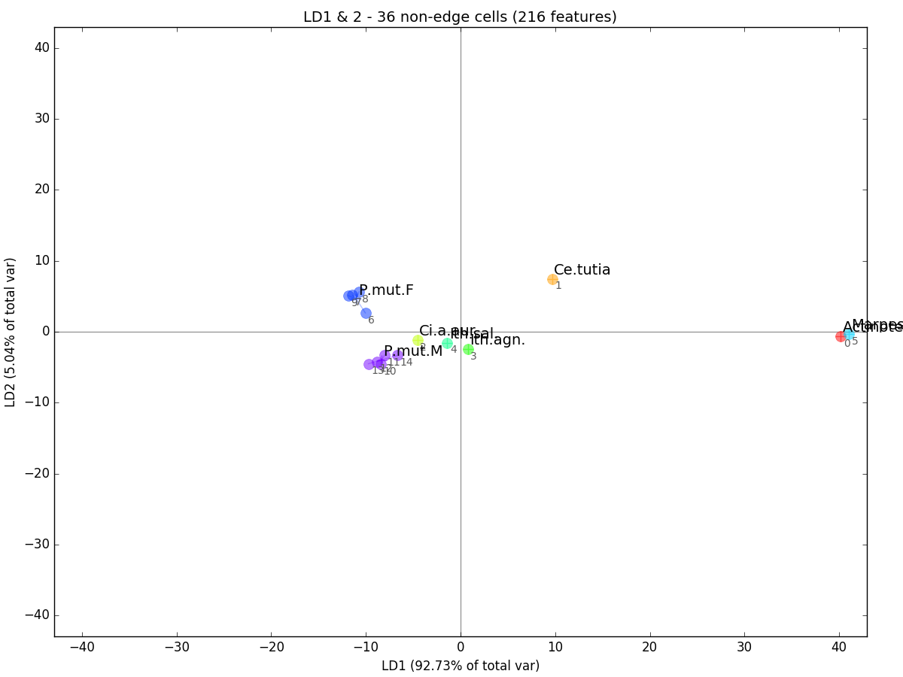
LDA is related to PCA except that instead of optimizing components for overall variability in the data, it maximizes the between-group variability while minimizing the within-group variability. Thus, LD1 is the axis with the highest variability between our groups and LD2, the second highest. You can see that our multi-observation groups are now even more tightly clustered than they were in the PCA plot.

### Examine component loadings
Loadings are a measure of the importance of each feature to particular component (or set of components). For instance, we may find that a particular grid cell is very important for discriminating between the groups included in our analysis. The following demonstrates how to extract these loadings and visualize them with the three methods included in wingrid.

**Get indices and labels for the 5 features that contribute most to LD1:**
```python
>>> print(an.loadings_top_contrib(comps=[1],n_highest=5,grid=None))
>>> print(an.loadings_top_contrib(comps=[1],n_highest=5,grid=g))
[ 78 135 120  84 121]
['gm22' 'gs82' 'gs32' 'gm32' 'gs33']
```
Feature labels are generated in the format [channel][statistic][cell no.], so feature 'gm22' is the mean of the green channel of cell 22.

**Plot the loadings on LD1:**
```python
>>> an.loadings_plot_bar(g,comp=1)
```
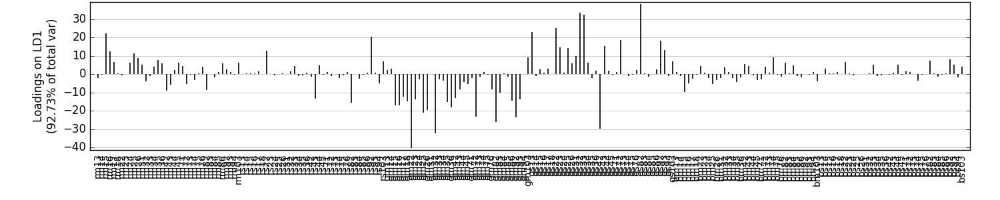


**Plot the loadings of LD1 and 2, highlighting the top 5 contributors:**
```python
>>> an.loadings_plot_2d(grid=g,comps=[1,2],n_highest=5)
```
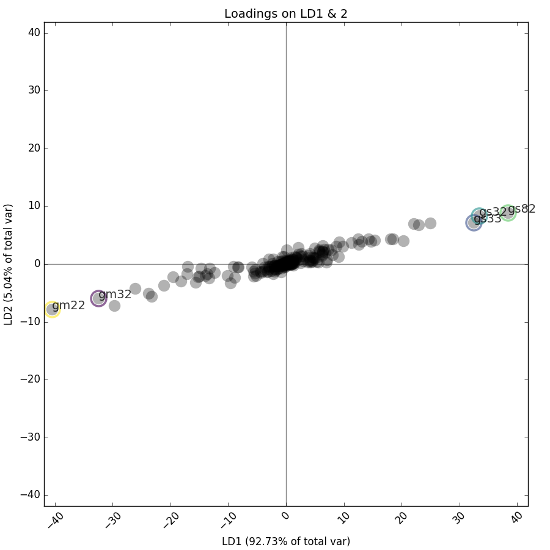

**Visualize LD1's loadings on an image:**
```python
>>> fn = '672.png'
>>> im = cv2.imread(os.path.join('images',fn))[:,:,::-1]
>>> g = Grid(12,10,background='black').fit(im)
>>> an.loadings_image_overlay(im,grid=g,comps=[1])
```
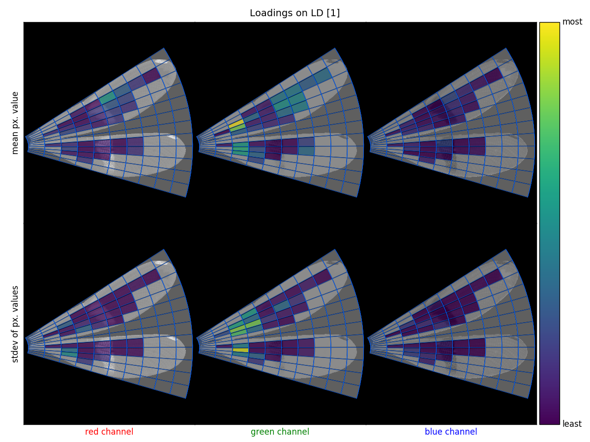


# Description
## Motivation
wingrid was designed as a tool for investigating mimicry among insects, specifically to quantitatively compare the appearance of toxic butterflies to their non-toxic mimics. The package has 3 main purposes, which are outlined below:
1. to fit a grid to and sample wings in an image,
2. to compare color features that have been sampled from a set of wings using Principal Component Analysis or Linear Discriminant Analysis, and
3. to visualize the results in the context of the wings.

## Grid fitting & color sampling

A deformable grid is fit to wings in an image in the following steps:
1. Mask wings in the image.
2. Calculate the convex hull of the mask.
3. Calculate the minimum-enclosing triangle around the convex hull.
4. Define the vertices of triangle ABC, such that:
  1. A is the left-most vertex of the min-enclosing triangle,
  2. B is the upper-most of the remaining 2 vertices, and
  3. C is the remaining vertex of the 3.
5. Calculate angles for the rows of the grid: lines evenly-spaced between lines AB and AC.
6. Calculate the beginning and ending of the columns: the closest and furthest pixels in the convex hull from point A.
7. Calculate radii for arcs around point A that are evenly-spaced between the beginning and ending arc from step 6.

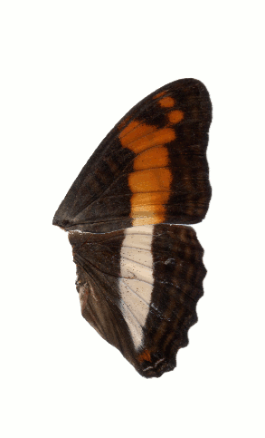

Color features are then sampled from the grid-fitted image:
1. The image is optionally converted to chromatic coordinates, which reduces some of the differences inherent in images captured from different sources and/or acquired using different lighting condition.
2. The image is optionally blurred with a 3x3 Guassian filter (helpful for noisy images).
3. For each cell in the grid, we find the coordinates for all pixels that fall within that cell. Some cells fall off the edge of the image or are outside of the image, completely. We call these 'edge cells' and keep track of where these occur in each image in the variable `f_mask` (short for feature mask). More about that later.
4. For each cell in the grid, we take the mean and standard deviations of the pixels in that cell for each of the red, green, and blue color channels, where `n_features = n_cells x 2 statistics x 3 channels` color features. For edge cells, color features are calculated using only the image pixels that fall within the image's mask, so a feature on an edge cell may be calculated using only a few pixels or no pixels (in which case `numpy.nan` is returned for the feature). For this reason, edge cells are tracked in `f_mask`, a Boolean list of length `n_features`, where `True` indicates that the feature was derived from a non-edge cell, and `False` indicates a feature from an edge cell.

## Analyzing color features
Color features sampled from an image dataset can be transformed in wingrid with either Principal Component Analysis (PCA) or Linear Discriminant Analysis (LDA, with a provided grouping variable). The functions that perform these transformations, `wingrid.Analyze.fit_pca` and `wingrid.Analyze.fit_lda`, are wrapper functions for scikit-learn's `sklearn.decomposition.PCA` and `sklearn.discriminant_analysis.LinearDiscriminantAnalysis`, respectively. Documentation for those functions is available at [scikit-learn's site](http://scikit-learn.org).

Before transformation, an array of features can be masked using a complementary array of feature masks, where features derived from edge cells ('edge features') are removed, leaving only features from cells that are non-edge throughout the dataset. This masking is optional but highly recommended.

## Visualizing color features
wingrid includes several plotting functions to visualize fitted grids and different aspects of transformed color features.
- `wingrid.Grid.plot_grid` : plots a fitted grid on the image on which it's been fitted, where edge cells can optionally be grayed out.
- `wingrid.Analyze.plot_comps` : plot 2 components of PCA- or LDA-transformed features in a scatterplot, where data can be colored and labeled by a variable `labels` and filtered by a Boolean mask, `filter_by`.
- `wingrid.Analyze.loadings_plot_bar` : plot the loadings of a component (the contribution that each feature has on that component) of transformed features.
- `wingrid.Analyze.loadings_plot_2d` : a scatterplot that simultaneously shows loadings on 2 different components and can highlight the top-contributing features.
- `wingrid.Analyze.loadings_image_overlay` : a 2x3 plot where columns represent color channels (rgb), rows represent statistic (mean or stdev), and each subplot shows the fitted grid plotted on the appropriate channel of an image.


# Acknowledgements & References

Grid design in the package was inspired by [[1]](#ref1). Chromatic coordinates ('chromaticity') are described in [[2]](#ref2).

This material is based upon work supported by the National Science Foundation Postdoctoral Research Fellowship in Biology under Grant No. 1611642. Any opinions, findings, and conclusions or recommendations expressed in this material are those of the author(s) and do not necessarily reflect the views of the National Science Foundation.

1. <a name="ref1"></a>Le-Qing, Z., and Zhen, Z. (2012). Automatic insect classification based on local mean colour feature and supported vector machines. Oriental Insects 46, 260–269.

2. <a name="ref2"></a>Gillespie, A.R., Kahle, A.B., and Walker, R.E. (1987). Color enhancement of highly correlated images. II. Channel ratio and “chromaticity” transformation techniques. Remote Sensing of Environment 22, 343–365.

# Author

Creator/maintainer: Will Kuhn (email: willkuhn [at] crossveins [dot] com,
Twitter: @crossveins)

I am a biologist who enjoys figuring out how to quantify biological traits from images. This is my first Github project and I hope you find it useful! Please let me know if you have questions, comments, or find this project helpful. See my [website](http://www.crossveins.com) for more information about me and my other projects.

# License

GNU GPL v3. Read full license [here](LICENSE).

# How to cite

Add this...

# How to contribute

I'd love to have your help making this project better! Thanks in advance! You can:

- Report bugs/issues [here](https://github.com/willkuhn/wingrid/issues)
- Help me fix things by making commits. There's a list of things to fixn in the [TODOs](#todos) below
- Add your own ideas in the [TODOs](#todos) to improve wingrid

# TODOs

Here's a semi-prioritized list of ideas I have to improve wingrid. Feel free to modify or add things.

Structural:
- [ ] speed up grid sampling with some optimization, specifically `Grid._get_px_coords_for_cell` and `Grid._sample_grid`
- [ ] add an overarching class to manage sampling from and analyzing a multi-image dataset

Visual:
- [ ] change the way x-axis labels are displayed in `Analyze.loadings_plot_bar` to make them less cramped when n_features>100
- [ ] add colorbar to `Analyze.loadings_plot_2d`
- [ ] choose a better color for grid cell numbers in grid-plotting functions
- [ ] in grid-plotting functions, reduce text size when plotting grid cell numbers on small cells (so numbers don't overlap)
- [ ] add option in plotting functions to save directly to a provided filepath
- [ ] add option for customizing coloring of plot elements
- [ ] in `Analyze.fit_pca` and `Analyze.fit_lda` allow `**kwargs` to the sklearn functions that they wrap
- [ ] make all functions work better with Pandas, especially plotting functions (like [seaborn does](http://seaborn.pydata.org/tutorial/axis_grids.html))
